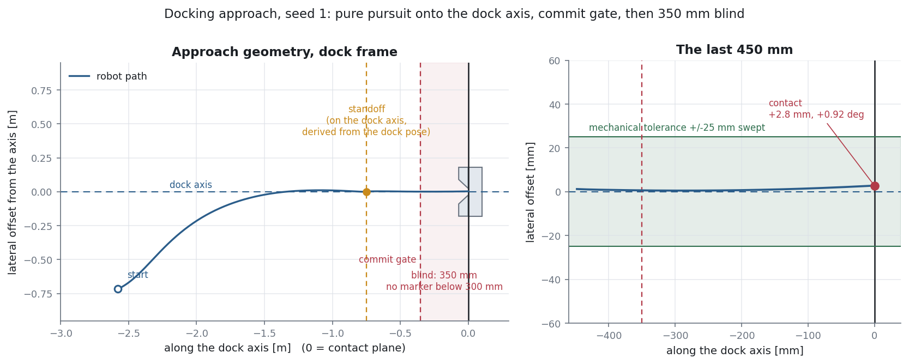
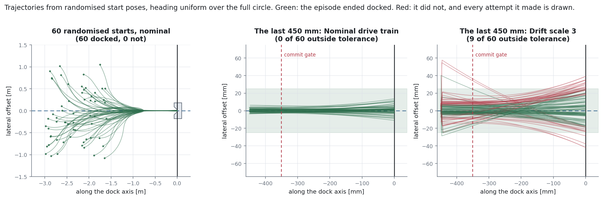
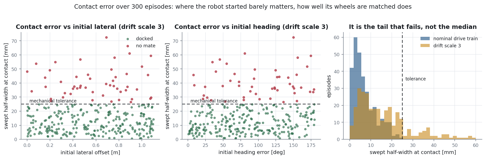
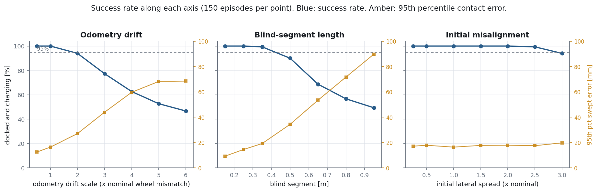
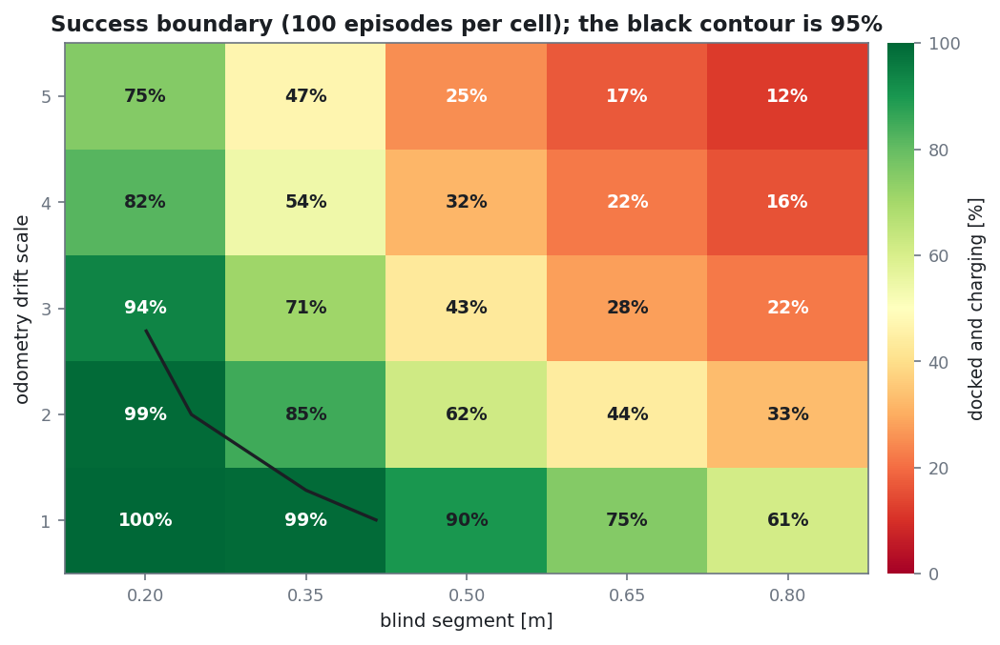
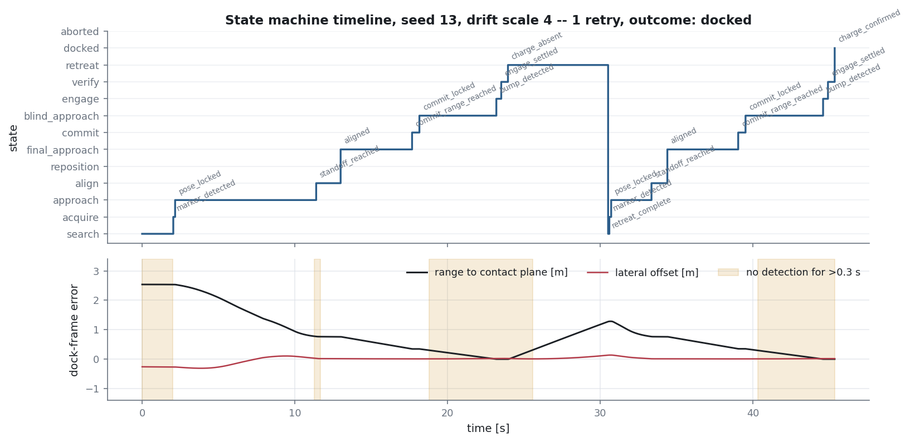

# autonomous-docking

A differential-drive robot drives itself onto a charging dock and ends up
within a few millimetres and a couple of degrees of a fixed piece of metal,
using a camera that stops working before it gets there.


---

## The problem

Docking looks like a solved problem right up until you need it to work every
time. The behaviour is five states on a whiteboard, the geometry is a straight
line, and the tolerance is a couple of centimetres. Then a robot that docked
ninety times in a row parks itself against the funnel lip, the fault report
says "it docked fine", and the battery is flat in the morning.

Three things make it hard, and they are all in the last half metre.

**The sensor gets worse as the requirement gets tighter.** A fiducial big
enough to detect at 3 m fills or leaves the frame at 0.3 m, and on most robots
the camera is mounted above and behind the docking shoe, so the marker is gone
before contact. The final approach is dead reckoning. Whatever error the robot
has when it loses the marker is the error it arrives with, plus drift.

**A differential drive cannot correct lateral error in place.** There is no
command that moves the robot 10 mm to its left. Lateral offset can only be
traded against heading and against distance travelled, so an approach that
arrives at the dock 20 mm off the axis has no move left that fixes it. It has
to be fixed metres earlier, or not at all.

**Contact is not docking.** A bump switch says the robot hit something. Only
charging voltage says the contacts mated. Every docking system that skips that
distinction eventually reports success while sitting there discharging.

This repository is the docking *software* -- perception model, dock-relative
estimator, guarded state machine, controller -- and a Monte Carlo harness that
measures where the design stops working. It is a simulation study. There is no
real robot and no real dock behind these numbers.

---

## What it does

- **A state machine, not a tangle of ifs.** Thirteen states, 35 transitions, and
  every transition guarded by a named pure function of one context object. The
  guards live in a registry, so the test suite can assert that every guard is
  tested, that every guard is used by the table, and that the abort transition
  is evaluated first in every state.
- **A go/no-go commit gate.** The robot stops at the last range where the
  marker is still observable, averages ten stationary detections, plans its
  blind segment, and refuses to enter the dock if the *predicted contact pose*
  falls outside a budget derived from the mechanical tolerance.
- **A blind segment that is planned, not just driven.** The last 300 mm is one
  constant-curvature arc chosen by a scan over its single free parameter,
  minimising the swept half-width at the contact plane -- the criterion the
  dock actually applies.
- **Differential-drive kinematics done honestly.** Non-holonomic constraints,
  wheel-speed and wheel-acceleration limits, and a clamp that scales `v` and
  `omega` together so saturation slows the robot down instead of straightening
  its path.
- **Perception that degrades the way fiducials really degrade.** Range-dependent
  noise, a minimum range below which nothing is reported at all, an incidence
  limit, dropouts that cluster near the range limits, two-frame latency, and
  planar pose ambiguity that returns a confidently mirrored heading.
- **An estimator with the three fixes a gated filter needs.** Latency
  compensation by odometry replay, an innovation gate for flipped poses, a
  covariance floor so a systematic wheel mismatch cannot be modelled away as
  white noise, and a divergence watchdog so the gate cannot lock the filter out
  of its own data.
- **A bounded retry policy.** Three attempts, two re-approaches per attempt, a
  search timeout, and a hard episode timeout listed first in every state.
- **Monte Carlo over seeds, and sweeps that find the boundary.** Distributions
  rather than one run, and a two-dimensional success surface over odometry
  drift and blind-segment length.

---

## Quickstart

```bash
git clone https://github.com/Pratyush150/autonomous-docking
cd autonomous-docking
pip install -r requirements.txt

python3 examples/demo.py --demo      # one narrated run + 80 episodes, ~20 s
python3 -m pytest -q                 # 142 tests, ~3 min, no network, no display
```

Use it from source, no install needed:

```python
import sys; sys.path.insert(0, "src")

from autodock import EpisodeConfig, run_campaign, summarise
from autodock.montecarlo import with_blind_radius

config = with_blind_radius(EpisodeConfig(), 0.5)   # camera loses the tag at 0.5 m
results = run_campaign(config, episodes=200, workers=8)
print(summarise(results, config.dock).headline())
```

Or drive the same core one tick at a time, which is what a robot would do:

```python
from autodock.runtime import DockingRuntime

runtime = DockingRuntime()
command = runtime.step(now=t, dt=0.04, observation=fix_or_none, bump=switch, charging=voltage)
send_twist(command.v, command.omega)
runtime.feed_odometry(measured_v, measured_omega, 0.04)
```

---

## Figures

Every figure is generated by a script in `examples/`. To regenerate all of them:

```bash
python3 examples/sweep.py --workers 8          # writes docs/sweep.csv
python3 examples/make_figures.py --workers 8   # writes docs/figures/*.png
```


The geometry every guard is written in. The standoff is computed from the dock
pose, not chosen in the world frame, so the final approach is a straight line
along the dock's own axis by construction. Right: the last 450 mm, with the
+/-25 mm mechanical tolerance band and the commit gate at 350 mm.


Sixty randomised starts, heading uniform over the full circle. Pure pursuit
spends metres of path removing lateral error, because that is the only currency
a differential drive can pay it in. The two close-ups are the same 60 seeds on
a nominal drive train and on one three times worse matched. The difference
between the two panels is drift, and almost all of it is spent in the last
350 mm, where the robot cannot see the marker.


Where the robot started barely matters. How well its wheels are matched
decides everything, and it decides it in the tail rather than the median.


Success rate along each axis, with the 95th percentile contact error on the
right-hand scale.


The boundary. The black contour is 95 % success.


A run on a badly matched drive train: it reaches the dock, the contact switch
closes, no charging voltage appears, and `charge_absent` sends it back out for
a second attempt that succeeds. The shaded bands are stretches with no
detection -- the acquisition sweep at the start, and the blind segment at the
end of each attempt.

---

## How it works

```
      camera + fiducial detector                    contact switch     charge sense
      (an ArUco/AprilTag pipeline;                        |                  |
       not part of this repo)                             |                  |
                 |                                        |                  |
                 v                                        |                  |
        MarkerObservation                                 |                  |
        late 2 ticks, range-dependent noise,              |                  |
        dropouts, sometimes a mirrored pose               |                  |
                 |                                        |                  |
   wheel         v                                        |                  |
   encoders --> DockEstimator  <-- odometry twist         |                  |
                 innovation gate                          |                  |
                 covariance floor                         |                  |
                 divergence watchdog                      |                  |
                 latency replay                           |                  |
                 |                                        |                  |
                 v                                        v                  v
          DockError(s, lateral, yaw) + sigmas + age  --> GuardContext <-------+
                 |                                        |
                 |                              DockingStateMachine
                 |                              35 guarded transitions,
                 |                              evaluated in order,
                 |                              abort first in every state
                 |                                        |
                 |                                        v
                 |                                    DockState
                 |                                        |
                 +--------------------> DockingController <+
                                              |
                                        (v, omega)
                                              |
                                        clamp_twist        scale both together,
                                              |            preserving curvature
                                        body_to_wheels
                                              |
                                        rate_limit_wheels  per-wheel slew limit
                                              |
                                              v
                                         differential drive base
```

**The dock frame is the only frame that matters.** Origin at the centre of the
contact plane, `+x` along the direction the robot must travel to enter. Every
guard, every control law and every metric is written in it as
`(s, lateral, yaw)`: remaining distance along the axis, signed offset from the
axis, heading relative to the axis. The simulator is the only thing that knows
about a world frame.

**One tick, in order.** Take a fiducial observation (which may be absent, is
two ticks old, and may be a mirrored solution). Fold it into the estimator,
re-propagated forward through the odometry that has accumulated since its
timestamp. Build the guard context. Evaluate the transition table. Ask the
controller for a twist. Clamp it to the wheel envelope, slew-limit the wheels,
and convert back to the twist the base can actually produce. Push that through
the imperfect drive train to move the robot, and integrate the *commanded*
wheels through *nominal* geometry to get odometry. The robot acts on the
second; it is graded on the first.

**The behaviour.**

```
SEARCH ----------marker_detected-------> ACQUIRE
ACQUIRE ---------pose_locked-----------> APPROACH          pure pursuit onto the dock axis
APPROACH --------standoff_reached------> ALIGN             turn in place, 0.75 m out
ALIGN -----------aligned---------------> FINAL_APPROACH    line following, closed loop
ALIGN -----------lateral_out_of_tol----> REPOSITION -> APPROACH
FINAL_APPROACH --commit_range_reached--> COMMIT            stop, average, plan, decide
COMMIT ----------commit_locked---------> BLIND_APPROACH    350 mm, open loop, one arc
COMMIT ----------commit_rejected-------> REPOSITION
BLIND_APPROACH --bump_detected---------> ENGAGE            seat the spring contacts
ENGAGE ----------engage_settled--------> VERIFY
VERIFY ----------charge_confirmed------> DOCKED
VERIFY ----------charge_absent---------> RETREAT -> SEARCH
RETREAT ---------attempts_exhausted----> ABORTED
<any state> -----episode_timeout-------> ABORTED
```

`ALIGN` turns on the spot. That fixes heading and, by construction, fixes
nothing else -- so when the estimate says the robot is off the axis at the
standoff, the machine sends it back out to fly the approach again rather than
letting it rotate uselessly. That transition is the non-holonomic constraint
written down as a guard.

`COMMIT` is where the design lives. The robot stops, because a stationary robot
is the only configuration in which a fiducial pose is free of motion blur and
latency error. It averages ten detections. It plans the blind segment -- one
constant curvature, chosen by scanning its single free parameter to minimise
the predicted swept half-width at the contact plane. And then it checks that
prediction against a budget, not its current position: the question is not
"am I close to the axis", it is "does the best blind segment available from
here still land inside the mechanical tolerance with margin for the drift that
comes after". Those are different questions and the second one is the useful
one.

### The mechanical tolerance, and why it is coupled

A shoe of length `L` held at heading `psi` and offset `lateral` sweeps a
corridor of half-width `|lateral| + L*|sin(psi)|`. With `L` = 120 mm and a
25 mm throat, six degrees of heading error costs 12.5 mm -- half the lateral
budget -- before the robot is off-centre at all. Lateral tolerance and heading
tolerance are not independent budgets, which is why the blind-segment planner
optimises the coupled quantity rather than nulling lateral offset. The full
derivation is in [docs/FAILURE_MODES.md](docs/FAILURE_MODES.md).

---

## The whole chain, hardware to software

This section exists because docking is the point where a stack of very
different things has to agree, and most explanations start somewhere in the
middle. Here we start at the metal and work up to the state machine, one layer
at a time, and say what each layer is for and what it breaks when it is wrong.

We are a software studio. We write firmware, drivers and robot software; we do
not build, wire or assemble hardware, and nothing is shipped to us. The
hardware described here is context, so that the software makes sense sitting on
top of it. The part we write is the onboard-computer side, and it is marked as
such throughout.

Two labels are used below and they mean different things:

- **(context)** -- a statement about real hardware, included so the chain hangs
  together. Not measured here, and nothing in this repository depends on it.
- **(modelled)** -- something `src/autodock` actually computes, with the number
  taken from the code.

Nothing in this repository has been run on a robot. See
[Limitations](#limitations).

### 1. The physical chain, bottom to top

```
              THE DOCK                                   THE ROBOT
        (bolted down, never moves)              (everything that has to move)

  +---------------------------+                +-----------------------------+
  |  fiducial marker          | ~~~ light ~~~> |  lens                       |
  |  funnel / guide ramps     |                |  image sensor               |
  |  spring contacts  + -     |                +--------------+--------------+
  +-------------+-------------+                               |
                |                                             | MIPI CSI-2 or USB
                | metal touches metal                         | frames
                |                                             v
                |                              +-----------------------------+
                |                              |  onboard computer           |
                |                              |  detector, pose solve,      |
                |                              |  estimator, state machine,  |
                |                              |  controller                 |
                |                              +--------------+--------------+
                |                                             |
                |                                             | USB serial, UART or CAN
                |                                             | wheel-speed setpoints
                |                                             v
                |                              +-----------------------------+
                |                              |  motor controller           |
                |                              |  current loop, velocity     |
                |                              |  loop, watchdog             |
                |                              +------+---------------+------+
                |                                     | PWM           ^
                |                                     v               | counts
                |                              +--------------+  +--------------+
                |                              | motors ->    |  | wheel        |
                |                              | gearboxes -> |->| encoders     |
                |                              | wheels       |  +--------------+
                |                              +------+-------+
                |                                     |
                v                                     v
     charge-sense line  ---+     bump switch  ---> back up to the onboard computer
                           |
  =========================+============================================
                                    floor
```

Read it bottom-up if you like -- the floor is what everything is ultimately
pushing against -- but the order below is the order a photon travels.

**The dock's contacts.** Two or more spring-loaded metal pads carrying the
charging voltage. They have to be *pressed*, not just touched, which is why a
docking system needs a deliberate push at the end rather than a stop.
If they are dirty or oxidised the robot arrives perfectly and never charges.
(context)

**The funnel or guide geometry.** Ramps or walls either side of the contacts
that convert a small lateral error into a sideways force as the robot enters,
sliding it onto centre. This is mechanical error correction, and it is free.
It also has a limit: enter too far off, or too crooked, and the robot's docking
shoe strikes the lip instead of sliding along it. That limit is the number
every guard in this repository is written against. (context; the limit itself
is modelled, as `DockGeometry`)

**The fiducial marker.** A printed square with a known black-and-white pattern
-- ArUco or AprilTag -- of known physical size, fixed to the dock face in a
known place. "Fiducial" just means a reference object put there deliberately to
be measured against. It is the only thing in the room whose position relative
to the contacts is known exactly, which is what makes it worth looking at. A
faded, scuffed or peeling marker degrades quietly: detections get rarer at long
range first, and the robot spends longer searching before anything happens.
(context)

**The lens.** Gathers light onto the sensor and sets the field of view (FOV) --
how wide a cone the camera sees. A wide lens keeps the marker in frame when the
robot is off to one side but makes the marker smaller in pixels, which makes
the pose noisier. A narrow lens does the opposite. The lens also introduces
distortion that must be calibrated out; uncalibrated distortion shows up as a
pose error that grows towards the edges of the image, so the robot's estimate
gets worse exactly when the marker is drifting out of view. (context)

**The image sensor.** Converts light into a grid of numbers over an exposure
window. Two properties matter for docking. Exposure time: too long and a moving
robot smears the marker's corners, which is pose noise. Shutter type: a rolling
shutter reads the image out row by row, so a moving robot sees a marker that is
skewed rather than square, and the pose solve happily returns the wrong answer
for the skewed shape. Global-shutter sensors expose every row at once and do
not have this problem. (context)

**The link that carries frames -- MIPI CSI-2 or USB.** MIPI CSI-2 (Camera
Serial Interface, the Mobile Industry Processor Interface standard) is a short
ribbon cable straight into the processor's camera block: low latency, low CPU
cost, but the camera has to be inches away. USB is longer and easier to wire
but adds buffering and jitter, and on a busy bus it drops frames. Either way,
what arrives is a frame that describes where the robot *was* when the shutter
opened, not where it is now. (context)

**The onboard computer.** A small Linux board. It runs the detector, the pose
solve, the estimator, the state machine and the controller, and it is the only
part of the chain that knows what "docking" means. Everything below it just
moves. This is the layer our software occupies. (context for the board;
modelled for everything it runs)

**The link to the motor controller -- USB serial, UART or CAN.** UART
(Universal Asynchronous Receiver/Transmitter) is the plain two-wire serial
port that USB-serial adapters emulate: simple, no error checking, and a
corrupted byte is silently a different number. CAN (Controller Area Network) is
a differential two-wire bus designed for exactly this job: it checksums every
frame, retransmits, prioritises messages, and tolerates electrical noise from
motors far better. The choice shows up as how often a wheel command is lost or
mangled, and how the system behaves when one is. (context)

**The motor controller.** A microcontroller plus power electronics. It takes a
wheel-speed setpoint and holds it, by measuring the actual wheel speed from the
encoders and adjusting the voltage it applies through PWM (Pulse Width
Modulation -- switching the supply on and off quickly, so the average voltage
is whatever fraction of the time it is on). It also owns the limits: maximum
current, maximum acceleration, and a watchdog that stops the motors if it stops
hearing from the computer. If the watchdog is missing, a computer that hangs
mid-approach leaves the robot driving at its last commanded speed. (context)

**The motors.** Turn current into torque. Their useful property here is that
they are fast and weak; the gearbox fixes the second part.

**The gearboxes.** Trade speed for torque, and add backlash -- a small dead
band where reversing direction moves the gears before it moves the wheel.
Backlash is why a robot that corrects its heading by wiggling left-right near
the dock ends up in a slightly different place than its encoders think.
(context)

**The wheels.** Where every number above becomes millimetres on the floor. The
*effective* radius of a wheel is not its nominal radius: it depends on tyre
compression, wear, load and surface. This is the single most important number
in the whole chain for docking accuracy, and it is the one nobody measures.
(context; the mismatch between the two wheels is modelled, as
`DriveTrainSpec.asymmetry_std`)

**The floor.** Provides the friction that turns wheel rotation into motion.
Where it does not -- a threshold strip, a cable, a wet patch -- the wheel turns
and the robot does not, and no sensor on the robot notices. (context)

**The wheel encoders.** Discs on the motor or wheel shaft that emit a pulse
train as they turn, so the controller can count revolutions and fractions of
one. They are the robot's only sense of its own motion. They measure what the
*wheel* did, which is not the same as what the *robot* did. (context)

**The IMU, where there is one.** An IMU (Inertial Measurement Unit) is a chip
containing accelerometers and rate gyroscopes. Its useful contribution here is
the gyroscope's heading rate, which is independent of the wheels and therefore
does not care about slip or tyre wear. It has its own problem: every rate gyro
has a slowly changing zero offset, so an unbiased-looking heading integrates
into a drifting one. This repository does not fuse a gyro, but it does model
that offset as an error on the true heading rate (modelled;
`DriveTrainSpec.gyro_bias_std`). (context)

**The bump or contact switch.** A mechanical switch that closes when the robot
presses against the dock. It answers exactly one question -- "am I touching
something" -- and it is the only reliable way to resolve the last few
millimetres of range, because the camera cannot see and odometry has drifted.
(context; modelled as the `bump` input)

**The charge-sense line.** A voltage measurement on the robot's own charging
input. It is the only signal that says the contacts actually mated. Bump says
the robot hit something. Charge says it hit the right thing in the right way.
Conflating the two is the failure this repository's `VERIFY` state exists for.
(context; modelled as the `charging` input)

### 2. Why odometry alone cannot dock, and neither can vision

This is the idea the whole repository is built around, so it is worth being
slow about.

**Odometry is precise and drifts without bound.** Odometry means working out
where you are by adding up how far your wheels have turned. Every tick, the
robot converts encoder counts into a small forward step and a small rotation,
and adds them to a running total.

The counts themselves are excellent -- an encoder resolves a fraction of a
degree of wheel rotation. The problem is the conversion. To turn wheel rotation
into distance you multiply by the wheel radius, and to turn the *difference*
between the two wheels into a rotation you divide by the track width. If your
assumed wheel radius is 1 % out, every metre you drive is 10 mm out. If the
left wheel's effective radius is 1 % larger than the right's, a robot commanded
to drive dead straight instead drives a gentle arc -- and its odometry, which
uses the same nominal radius for both, insists it went straight.

Four things cause this, and they are all ordinary: wheel diameter that differs
from the number in the config file, slip on the floor, uneven tyre wear between
the two sides, and payload sitting off-centre so one tyre compresses more than
the other.

The fatal property is that these errors *integrate*. They are not noise that
averages out over time; they are a bias that accumulates. Drive further and the
error is larger, always. There is no amount of odometry filtering that fixes
it, because the information simply is not there.

In this repository the modelled drive train has a 1.5 % standard deviation on
the mismatch between the two effective wheel radii, which produces a heading
error growing at about 3 degrees per metre driven (modelled;
`DriveTrainSpec.asymmetry_std` and `EstimatorNoise.yaw_per_metre`). Lateral
departure over a blind run of length `d` grows as `kappa * d^2 / 2` --
quadratic, so the error over the last 300 mm is four times the error over the
last 150 mm.

**Vision is absolute and stops working close in.** A fiducial pose fix is
different in kind. It does not accumulate: each frame is an independent
measurement of where the robot is relative to the dock, and a frame taken after
an hour of driving is exactly as good as the first one. It is noisier than
odometry frame-to-frame, but the noise does not grow.

It has a different problem: it runs out. The marker has to be big enough to
detect at the range where the approach starts, which means it fills the frame
and then overflows it as the robot closes. On most robots the camera sits above
and behind the docking shoe, so the marker leaves the field of view entirely
while the shoe is still short of the contacts. In this repository nothing at
all is reported below 0.30 m (modelled; `MarkerModel.min_range`), detections
get flaky in a band above that, and the detector is treated as silent past 60
degrees of incidence (modelled; `MarkerModel.max_incidence`).

```
   accuracy
   required
      ^                                                          ,
      |                                     the requirement    ,'
      |                                     gets tighter -->  ,'
      |                                                     ,'
      |    vision available          vision gone          ,'
      |  <----------------------> <---------------------,'-->
      |                                               ,'
      |     odometry error  ______....----''''''''''''
      |     grows      ....''
      +-----------------------------------------------------------> distance
       3 m                        0.30 m                        0 m
                              (marker lost)                  (contacts)
```

**So docking is the handover.** The two sensors are complementary in exactly
the wrong way: the absolute one dies at the moment the relative one has
accumulated the most error and the tolerance is tightest. Everything difficult
about docking lives in the last stretch where you have already lost the good
sensor and have not yet touched the metal.

That reframes the problem usefully. The question is not "how do I drive to the
dock". It is: *when the camera goes quiet, how good is my estimate, and is it
good enough to spend the remaining distance on dead reckoning alone?* The
answer has to be computed before going blind, because afterwards there is no
new information to change your mind with.

That is what `COMMIT` is: the robot stops at the last range where the marker is
still observable, spends time there gathering fixes while stationary, predicts
where the blind segment will end, and either goes or backs out. It is the only
place in the behaviour where the robot gets to choose whether to accept the
handover.

### 3. The signal path, and the loop it closes

```
   dock marker
        |  photons                                       continuous
        v
   +---------------------------+
   | lens + image sensor       |  exposure: as long as the light demands
   +---------------------------+
        |  one frame in memory                    50-120 fps capable,
        |                                         commonly configured
        |                                         slower           (context)
        v
   +---------------------------+
   | fiducial detector         |  finds the 4 corners, in pixels
   | apriltag_ros / aruco_ros  |  NOT part of this repository
   +---------------------------+
        |  4 image points + the marker's ID
        v
   +---------------------------+
   | pose solve (PnP)          |  known 3-D corners + camera intrinsics
   +---------------------------+  -> where the camera must have been
        |  marker pose in the CAMERA OPTICAL frame
        v
   +---------------------------+
   | transform chain           |  optical -> camera -> body -> dock
   +---------------------------+
        |  MarkerObservation(s, lateral, yaw, sigmas, age)
        |  2 control ticks old                            (modelled)
        v
   +---------------------------+
   | DockEstimator             | <---- odometry twist (v, omega)   25 Hz
   | replay, gate, floor,      |
   | watchdog                  |
   +---------------------------+
        |  DockError(s, lateral, yaw) + sigmas + age
        v
   +---------------------------+
   | guards -> state machine   |  35 transitions, abort first      25 Hz
   +---------------------------+
        |  DockState
        v
   +---------------------------+
   | DockingController         |  pure pursuit / turn / line / arc
   +---------------------------+
        |  body twist (v, omega)
        v
   +---------------------------+
   | clamp_twist               |  scale both, preserve curvature
   | body_to_wheels            |  twist -> left/right wheel speed
   | rate_limit_wheels         |  per-wheel slew limit
   +---------------------------+
        |  two wheel-speed setpoints, rad/s               25 Hz (modelled)
        v
   +---------------------------+
   | motor controller          |  velocity loop  around 1 kHz      (context)
   |                           |  current loop   8-25 kHz          (context)
   +---------------------------+
        |  PWM
        v
   +---------------------------+
   | motors -> gearboxes ->    |
   | wheels -> floor           |
   +---------------------------+
        |
        +--> encoders --> odometry --------------------+
        |                                              |
        +--> the robot is somewhere new,               |
             so the next frame looks different         |
                        |                              |
                        +--------> back to the top <---+
```

Walking it once, in words:

**Photons to a frame.** Light reflects off the marker, the lens focuses it, and
the sensor integrates it over the exposure window into a grid of pixel values
sitting in the computer's memory.

**Frame to corners.** The detector finds the black square, reads its coded
interior to get an ID, and refines the four corner positions to sub-pixel
accuracy. Its output is four `(u, v)` pixel coordinates and a number.

**Corners to a pose.** This is the step that surprises beginners, so plainly:
we know the marker is a flat square of a specific size, so we know the 3-D
coordinates of its four corners in the marker's own frame -- for a 100 mm tag,
`(±50, ±50, 0)` mm. We have just measured where those four points landed in the
image. We know the camera's intrinsics: focal length and optical centre, from
calibration. There is exactly one position and orientation of the camera that
would project those known 3-D points onto those measured pixels, and solving
for it is a standard problem called PnP (Perspective-n-Point). Invert the
answer and you have the marker's pose relative to the camera.

"Pose" here means six numbers: three of position and three of rotation. Docking
on a flat floor only uses three of them -- forward, sideways, and heading --
but the solve produces all six, and the ones it produces worst are the
out-of-plane rotations, because they are estimated from the small perspective
difference between the near and far edges of a nearly head-on square. That is
why the modelled yaw noise grows faster with range than the translation noise
does (modelled; `MarkerModel.yaw_sigma` versus `lateral_sigma`).

**Pose to something the robot can steer on.** The pose comes out in the camera
optical frame. Three fixed transforms move it into the frame the behaviour is
written in -- optical to camera, camera to robot body, and marker to dock.
Section 4 is entirely about this step, because it is where real bugs live.

**Fold it into the estimate.** The fix is old by the time it arrives, so the
estimator replays the odometry accumulated since its timestamp forward before
using it. Then it checks the fix against what it already believes: a fix too
far from the prediction, measured in standard deviations, is rejected rather
than absorbed, which is how a mirrored fiducial pose is thrown away instead of
steering the robot. The estimator carries a floor under its own uncertainty so
it cannot become more confident than the model deserves, and a watchdog that
re-initialises it if the gate rejects too many fixes in a row (modelled;
`DockEstimator`).

**Decide.** The estimate plus the bump and charge readings become a
`GuardContext`. The state machine evaluates its transition table in order --
abort conditions first, in every state -- and either changes state or does not.

**Command.** The controller for the current state emits a body twist: `v`, how
fast forward, and `omega`, how fast to rotate. Two numbers, and they are what a
differential drive can be asked for. Nothing else.

**Twist to wheels.** Inverse kinematics, and it is one line of arithmetic:
`left = (v - omega * track/2) / wheel_radius` and
`right = (v + omega * track/2) / wheel_radius`. Wanting to turn means asking
one wheel to go faster than the other; wanting to spin in place means asking
them to go opposite ways. The clamp comes first: if either wheel exceeds its
speed limit, both `v` and `omega` are scaled by the same factor, so the robot
follows the same curved path more slowly rather than a straighter path at the
speed asked for.

**Wheels to motion.** The motor controller receives two speed setpoints and
runs its own loops to hold them, adjusting PWM against encoder feedback many
times for every one of our ticks. Torque reaches the floor and the robot moves.

**And back around.** The encoders report what the wheels did, which becomes an
odometry twist and goes into the estimator. The robot is now somewhere new, so
the next camera frame shows the marker from a different angle, so the next pose
fix is different, so the next estimate is different, so the next command is
different.

**That last paragraph is the point.** None of these blocks is clever on its
own. The controller does not compute a trajectory to the dock and execute it;
it looks at the current error and emits a correction, twenty-five times a
second, and the errors shrink because each correction is applied to a world
that has already responded to the previous one. This is what "closing the loop"
means, and it is why a system built from simple parts can be accurate: it never
has to be right, only consistently less wrong.

It is also why the blind segment is dangerous. During those last 300 mm the
loop is open -- the robot is still commanding, but nothing is measuring the
result against the dock. Errors stop being corrected and start accumulating.
Everything the design does at `COMMIT` is an attempt to enter that open-loop
stretch with as little error as possible, because it is the last decision that
gets made with information.

### 4. Coordinate frames

A frame is just an origin and three axes that some numbers are measured
against. Every pose in a robot is meaningless without knowing which frame it is
in, and almost every mysterious docking bug is a pose used in the wrong one.

Four frames matter here.

**The camera optical frame.** Z forward along the direction the lens points, X
right, Y down. This convention is inherited from computer vision, where the
image X axis runs right and Y runs down, and it is the frame every PnP solver
returns its answer in. REP-103 spells it as a frame-name suffix -- a frame
whose name ends in `_optical` uses these axes -- and drivers in practice name
the frame something like `camera_optical_frame`.

**The robot body frame.** X forward, Y left, Z up, origin usually on the floor
between the drive wheels. This is the robotics convention (REP-103 -- REP means
ROS Enhancement Proposal, the numbered documents that fix these conventions).

Note that the two are different, and not by a little: they disagree about what
"Y" points at and about which axis is forward. The rotation between them is
fixed and known, but it is not the identity, and getting it wrong produces a
robot that steers confidently in the wrong direction. This is the single most
common frame bug in vision-guided robots.

**The dock frame.** Origin at the centre of the contact plane, +X along the
direction the robot must travel to enter. Its axis is the approach axis. It is
fixed to the dock, not to the room.

**The world or odom frame.** A fixed frame the robot integrates its odometry
in. "odom" is short for odometry; it is continuous and smooth but drifts
without bound, which is exactly the property described in section 2.

The chain, and where each link comes from:

```
   world / odom
        |
        |  integrated from wheel encoders -- smooth, drifts, unbounded
        v
   robot body  (base_link:  X fwd, Y left, Z up)
        |
        |  CAMERA MOUNT: a fixed translation (up, forward, sideways)
        |  and a fixed rotation (tilt down, any yaw)
        |  <-- measured once, by hand or by calibration. Never changes
        |      unless somebody bumps the bracket
        v
   camera link
        |
        |  a fixed axis relabelling: body (X fwd, Y left, Z up)
        |  -> optical (Z fwd, X right, Y down)
        v
   camera optical frame  (_optical suffix: Z fwd, X right, Y down)
        |
        |  MEASURED EVERY FRAME by the PnP solve
        v
   marker frame
        |
        |  a fixed offset, set by where the marker was stuck on the dock
        v
   dock frame  (+X = the direction the robot must travel to enter)
```

Compose that chain and invert it and you have the robot's body pose in the dock
frame, which is the only thing the behaviour wants. In ROS 2 this composition
is done for you by TF (the transform library; TF2 is the current version),
which keeps a time-stamped tree of these relationships and can answer "where
was A relative to B at time t".

**Where the camera mount enters, and why it matters.** The mount offset and
tilt sit between the body frame and the camera, so they affect every fix
equally. A bracket that is 10 mm further forward than the configured value
biases every range measurement by 10 mm. A bracket tilted 1 degree further down
than configured biases every heading estimate. Because it is a bias and not
noise, averaging more detections does not help -- it converges neatly on the
wrong answer, which is worse than being visibly noisy. This is why "extrinsic
calibration between camera and drive frame" is the first item on the list of
what a real deployment would additionally need.

The mount also sets the blind-segment length, which the sweeps in this
repository identify as the most expensive parameter in the design. A camera
mounted lower and further forward keeps the marker in view closer in, and
[Where it stops working](#where-it-stops-working) puts a number on what that is
worth.

**Why the dock frame is the one that matters.** The robot does not care where
it is in the room. Two robots, one in a corridor and one in a warehouse, at
identical `(s, lateral, yaw)` relative to their docks, should do exactly the
same thing. Writing the behaviour in the dock frame makes that true by
construction: no guard mentions the world, no control law mentions the world,
and the simulator is the only component that knows a world frame exists.

It also removes an entire class of bug. If the approach were planned in world
coordinates, then a localisation jump -- the moment a SLAM system corrects
itself and the robot's believed position moves 50 mm sideways -- would move the
target with it, mid-approach. In the dock frame that jump is invisible, because
the marker is measured directly and the answer never passed through the map.

The three numbers, concretely (modelled; `DockError`):

- `s` -- remaining distance along the dock axis. Zero at the contact plane.
- `lateral` -- signed perpendicular offset from the axis. Zero on the axis.
- `yaw` -- heading relative to the axis. Zero pointing straight in.

And the geometry they describe:

```
   lateral
   (+, left of the axis)
      ^
      |                                                     contact plane
      |                                                        s = 0
      |         s = 0.75 m            s = 0.35 m                 |
      |         STANDOFF              COMMIT GATE                |
      |            |                       |                     |
 +25mm|- - - - - - | - - - - - - - - - - - | - - - - - - - - - -[|]  tolerance
      |            v                       v                     |  band
      +------------o-----------------------o--------------------[|]--> +x
      |          robot                                           |  (dock axis)
 -25mm|- - - - - - - - - - - - - - - - - - - - - - - - - - - - -[|]
      |            |<---- closed loop ---->|<-- 350 mm blind --->|
      |            |    camera + odometry  |   odometry only     |
      |
      |     ALIGN turns here.        COMMIT stops here,
      |     Heading only -- a        averages 10 fixes,
      |     differential drive       plans the arc, and
      |     cannot step sideways.    decides go / no-go.
```

The corridor the robot sweeps as it enters is not its width but
`|lateral| + shoe_length * |sin(yaw)|`, which is why the tolerance band above
is drawn against a *coupled* quantity rather than against lateral offset alone.
That derivation is in
[docs/FAILURE_MODES.md](docs/FAILURE_MODES.md).

### 5. Rates, and the latency budget

Nothing in the chain runs at one speed. Each layer runs at whatever rate it
needs, and they are nested inside each other:

```
  +--------------------------------------------------------------------+
  |  behaviour: state machine + controller          25 Hz  (modelled)   |
  |  one tick = 40 ms                                                   |
  |                                                                     |
  |  +--------------------------------------------------------------+  |
  |  |  perception: frame -> detect -> pose                          |  |
  |  |  camera 50-120 fps capable, usually run slower  (context)     |  |
  |  |  detector 10-25 fps on a Pi-class CPU,          (context)     |  |
  |  |           50-110 fps GPU-accelerated at 720p                  |  |
  |  |  modelled here as one observation per tick     (modelled)     |  |
  |  +--------------------------------------------------------------+  |
  |                                                                     |
  |  +--------------------------------------------------------------+  |
  |  |  motor controller velocity / position PID                     |  |
  |  |  around 1 kHz                                    (context)    |  |
  |  |                                                               |  |
  |  |    +-----------------------------------------------------+    |  |
  |  |    |  motor controller current / FOC loop                 |    |  |
  |  |    |  8-25 kHz                            (context)       |    |  |
  |  |    +-----------------------------------------------------+    |  |
  |  +--------------------------------------------------------------+  |
  |                                                                     |
  |  encoder counts arrive as the wheels turn: roughly 400-3600 counts  |
  |  per wheel revolution on common small-robot gearmotors  (context)   |
  +--------------------------------------------------------------------+
```

**Why nested, and why inner loops must be faster.** Each loop assumes the loop
inside it has already converged. When our controller asks for 0.09 m/s it is
assuming that by the time the next tick comes round, the wheels are actually
turning at that speed -- so the motor controller's velocity loop must settle
well inside our 40 ms tick, and its current loop must settle well inside the
velocity loop's period. If an inner loop is not comfortably faster, its
dynamics leak into the outer loop, which then has to model them, and the outer
loop's simple assumption -- "I command a twist and I get it" -- stops being
true. Roughly an order of magnitude per level is the usual rule. (context)

The rates in this repository:

| loop | rate | where it comes from |
|---|---|---|
| behaviour tick (estimator, guards, controller) | 25 Hz, `dt` = 0.04 s | `EpisodeConfig.dt`, and `DockingNode(rate_hz=25.0)` |
| observation arrival | one per tick, when the marker is visible | `FiducialSensor.observe` |
| observation age when used | 2 ticks = 80 ms | `MarkerModel.latency_steps` |
| motor-controller loops | not modelled at all | -- |

**The latency budget.** Every stage between the shutter opening and the
controller acting adds delay. In a real system it is roughly: exposure, plus
readout and transfer over CSI or USB, plus detection and the pose solve, plus
whatever transport carries the result between processes. (context)

This repository does not model those stages individually. It models their sum:
an observation handed to the estimator is two control ticks old (modelled;
`MarkerModel.latency_steps = 2`). At 25 Hz that is 80 ms.

Eighty milliseconds is not an abstraction. It is a distance, and the distance
depends on how fast the robot is going:

| speed | where it comes from | 80 ms of travel |
|---|---|---|
| 0.30 m/s | `ControllerGains.approach_speed` | 24 mm |
| 0.09 m/s | `ControllerGains.final_speed` | 7.2 mm |
| 0.07 m/s | `ControllerGains.blind_speed` | 5.6 mm |
| 0 m/s | stopped at `COMMIT` | 0 mm |

Read the top row against the 25 mm mechanical tolerance and the problem is
obvious: a robot that acts on an 80 ms-old fix at approach speed is acting on
information that is a whole tolerance band out of date. Two things in the
design address it. The estimator replays the odometry accumulated since the
fix's timestamp, which converts most of that staleness back into a correct
present-tense estimate. And `COMMIT` stops the robot -- at zero speed, latency
costs zero millimetres, which is the cleanest way to remove an error term
there is. The stop is not caution; it is arithmetic.

The general form, worth carrying away: **latency times speed is a distance, and
that distance is how wrong your picture of the world is.** Halving the speed
and halving the latency are the same thing to first order, which is why slowing
down is a legitimate engineering fix and not a cop-out.

### 6. Who owns what

The split between the two computers is not arbitrary, and it is the same on
nearly every mobile robot.

```
  +-------------------------------------------------------------+
  |  ONBOARD COMPUTER            -- perception, state, strategy  |
  |                                                              |
  |  What is the dock's pose relative to me?                     |
  |  How much do I trust that?                                   |
  |  What phase of the manoeuvre am I in?                        |
  |  Should I commit, or back out and try again?                 |
  |  Am I actually charging?                                     |
  |                                                              |
  |  <---- THIS REPOSITORY IS THIS BOX ---->                     |
  +-------------------------------+------------------------------+
                                  |
                     (v, omega)   |   twist down
                     odometry     |   odometry up
                                  v
  +-------------------------------------------------------------+
  |  MOTOR CONTROLLER            -- current, velocity, safety     |
  |                                                              |
  |  Hold this wheel speed.                                      |
  |  Do not exceed this current.                                 |
  |  Do not exceed this acceleration.                            |
  |  If the computer goes quiet, stop. (watchdog)                |
  |  Report encoder counts.                                      |
  +-------------------------------------------------------------+
```

The dividing line is time. The motor controller owns everything that must
happen faster than a network round trip and everything that must keep happening
when the software above it fails. A current limit that only exists in Python is
not a current limit. A stop-on-comms-loss that lives on the same computer that
just hung is not a safety feature. (context)

The onboard computer owns everything that requires knowing what the robot is
trying to do. The motor controller has no concept of a dock.

**What this repository models.** Concretely:

- **Perception statistics** -- range-dependent noise, a minimum range,
  an incidence limit, dropouts clustering near the range limits, two-tick
  latency, and planar pose ambiguity (`perception.py`).
- **Differential-drive kinematics** -- the non-holonomic constraint, wheel
  speed and acceleration limits, the curvature-preserving clamp, and exact arc
  integration (`kinematics.py`).
- **Drive-train asymmetry and the odometry that cannot see it**
  (`odometry.py`).
- **The dock-frame estimator** -- latency replay, innovation gate, covariance
  floor, divergence watchdog (`estimator.py`).
- **The state machine and its guards** (`states.py`, `machine.py`).
- **The controllers** -- pure pursuit, turn in place, line following, and the
  blind-arc planner (`controller.py`).

**What it assumes rather than models.** Equally concretely:

- **No images.** The fiducial detector is a statistical model of a detector's
  output. There are no pixels anywhere in this repository, no lighting, no
  calibration error, no rolling shutter.
- **No contact physics.** The dock is a pass/fail geometric criterion at the
  contact plane. A real funnel guides a shoe that enters slightly off-centre,
  and can also jam it; neither is simulated.
- **No motor electrical dynamics.** Commanded wheel speeds become actual wheel
  speeds instantly, subject only to the acceleration limit and a small
  multiplicative noise. No current, no torque, no back-EMF, no thermal limit.
- **No link behaviour.** No dropped serial frames, no CAN arbitration delay, no
  jitter between the computer and the motor controller.
- **No floor interaction** beyond that multiplicative noise. No thresholds, no
  cables, no discrete slip events.

The [Limitations](#limitations) section lists the rest. The short version: this
repository models the decision layer carefully and everything below it
generously.

### 7. What goes wrong, layer by layer

Each row is a real failure, what it looks like to somebody watching the robot
rather than reading its logs, and which layer has to be the one that handles
it. "Handled here" means this repository has a guard for it.

| layer | what goes wrong | what it looks like from outside | which layer must handle it |
|---|---|---|---|
| optics | marker faded, scuffed, peeling, or lens smudged | robot circles the dock for a long time before anything happens; worse at long range first | maintenance, plus a bounded search -- `search_exhausted` (handled here) |
| optics | camera bracket knocked out of alignment | robot docks consistently 15 mm to one side, every time, on every dock | calibration. Nothing in software can see it, because a bias looks like the truth |
| sensor | sun through a window saturating the frame | detections vanish at one time of day, at one dock, and return an hour later | sensor auto-exposure and dock siting; behaviour must survive it -- `search_exhausted`, retries (handled here) |
| sensor | rolling shutter plus motion | pose is subtly wrong only while moving, correct when stopped | global-shutter hardware; mitigated by stopping to measure, which is what `COMMIT` does |
| compute | detector too slow, frames queue up | robot oscillates: it steers on where it was, overshoots, corrects, overshoots | perception layer must drop stale frames; estimator latency replay bounds the damage (modelled) |
| compute | onboard computer hangs mid-approach | robot drives into the dock, or past it, at its last commanded speed and does not stop | **the motor controller.** A command watchdog is the only thing that helps, and it must not live on the computer that hung |
| link | dropped or corrupted serial frame | one tick of missing or wrong wheel command; usually invisible, occasionally a lurch | link layer (CAN checksums, or a sequence number over UART) plus the controller watchdog |
| motor controller | current limit trips on the final push | robot stops just short, bump never closes, drive keeps commanding | motor controller reports it; behaviour catches the symptom -- `travel_budget_exceeded` (handled here) |
| motor controller | velocity loop poorly tuned | commanded and actual speed differ; odometry is right, the robot is not where it should be | motor controller tuning. Above it, this is indistinguishable from drive-train error |
| actuation | wheel slips on a threshold strip or a cable | odometry reports distance the robot did not travel; arrives short or off-axis | nothing catches it before contact. `charge_absent` catches it after (handled here) |
| actuation | one tyre worn more than the other | robot arrives millimetres off-axis, and every retry fails in exactly the same way | calibration. Retries provably do not fix it -- see [docs/FAILURE_MODES.md](docs/FAILURE_MODES.md) §4 |
| dock | nudged out of position by a cleaner | robot approaches the wrong patch of wall, or approaches fine but from a bad angle | the map and the navigation layer, not the docking behaviour. The marker moves with the dock, so the last two metres still work -- the staging pose no longer does |
| dock | contacts oxidised or dirty | bump closes, robot sits there, no charging voltage ever appears, battery flat by morning | `VERIFY` and `charge_absent`, then bounded retries, then `attempts_exhausted` (handled here) |
| dock | dock occupied by another robot | robot approaches, bumps something that is not a dock, no charge | a dock-occupied check against the fleet manager; below that, `charge_absent` degrades gracefully |

Two things are worth noticing about that table.

**Most rows are handled somewhere other than where they happen.** A hung
computer is a motor-controller problem. A worn tyre is a calibration problem.
The docking behaviour cannot fix any of them; what it can do is fail safely,
notice, and not report success. That is a lower bar than "handle" and it is the
right one.

**`charge_absent` is the backstop for a surprising number of rows.** Whenever
something upstream goes wrong in a way nothing else detects, the outcome is the
same: the robot touches the dock and no voltage appears. That is why contact
and charge are two separate guards in this design and not one. A system that
treats bump as success converts every row in this table into a flat battery.

`docs/FAILURE_MODES.md` covers the software-layer rows in proper depth -- the
derivations, the specific guard, and the numbers behind each threshold. This
table is the wider view: the same system seen from the hardware end, including
the rows no amount of software fixes.

### 8. What this looks like in a real ROS 2 stack

Everything above is deliberately framework-free: `autodock.runtime` takes an
observation, a bump reading and a charge reading, and returns a twist. On a
real robot something has to fetch those and deliver that, and on most robots
that something is ROS 2. This subsection names the real pieces so the mapping
is concrete.

**One caveat first, and it is not a small one.** ROS 2 is not installed in the
environment this repository was developed and measured in. The node in
`src/autodock/ros_node.py` has been written and its message-conversion
arithmetic is unit tested, but it has never been run, against a robot or
against a simulator. Everything in this subsection is verified against the
upstream specifications and source, not against a running system.

```
  +----------------+  image_raw    +-------------+  image_rect   +---------------+
  | camera driver  |-------------->|  image_proc |-------------->|  apriltag_ros |
  |                |  camera_info  | (rectifies) |  camera_info  |  or aruco_ros |
  +----------------+------+------->+-------------+-------------->+-------+-------+
                          |                                              |
                          +----------------------------------------------+
                                                                         | /tf
                                                                         v
                                                                  +-------------+
                                                                  |   TF tree   |
                                                                  | map -> odom |
                                                                  | -> base_link|
                                                                  +------+------+
                                                                         |
   +------------------------+   odom  (nav_msgs/Odometry)   +------------v-------+
   | base driver, or        |------------------------------>| docking behaviour  |
   | diff_drive_controller  |                               | (autodock.runtime) |
   |                        |<------------------------------|                    |
   +------------------------+   cmd_vel                     +--------------------+
```

**Frames, per REP-105.** The standard tree is `map` -> `odom` -> `base_link`,
and the rule that makes it work is that each frame has exactly one parent. So
localisation never publishes `map` -> `base_link` directly; it reads
`odom` -> `base_link` from the odometry source and publishes the correction
`map` -> `odom` instead. The two frames have deliberately opposite properties,
and REP-105 states them explicitly: a robot's pose in `odom` is continuous and
smooth but drifts without bound, while its pose in `map` does not drift but can
jump discretely at any time.

That is section 2's trade-off written into a naming convention, and it is why
the docking behaviour uses neither. A discrete jump in `map` mid-approach would
move the goal; unbounded drift in `odom` is exactly what the last 350 mm cannot
afford. The dock frame is measured directly and is immune to both.

**Camera topics.** `sensor_msgs/msg/CameraInfo` carries the intrinsics and
lives on `camera_info` in the same namespace as the image topics, so
`/my_camera/image_raw` pairs with `/my_camera/camera_info`. `image_proc`
consumes that pair and produces `image_rect`, the undistorted image. Fiducial
detectors want the rectified topic, not the raw one -- feeding a detector
distorted images gives poses that are wrong towards the edges of the frame,
which is section 4's calibration bias arriving by a different route.

**The detector.** Two packages are the usual choices, and they differ in a way
that matters for wiring:

- **`apriltag_ros`** (christianrauch), subscribes `image_rect` and
  `camera_info`, publishes `detections` as
  `apriltag_msgs/msg/AprilTagDetectionArray` and broadcasts the tag pose on
  `/tf` with `child_frame_id` like `tag36h11:0`. Worth knowing: the detection
  message carries only 2-D information -- family, id, corners, homography --
  and *no pose field*. The 3-D pose is available only through TF. (There is
  also an older ROS 1 lineage under `AprilRobotics/apriltag_ros` whose message
  does carry a pose; they are not the same package.)
- **`aruco_ros`** (PAL Robotics). Its `single` node tracks one known marker id
  and publishes `pose` as `geometry_msgs/msg/PoseStamped` plus a TF broadcast;
  its `marker_publisher` node publishes all markers as
  `aruco_msgs/msg/MarkerArray`, where each `Marker` carries a
  `geometry_msgs/PoseWithCovariance`.

The node in this repository subscribes to `dock/marker_pose` as a
`geometry_msgs/PoseStamped`, which is the shape `aruco_ros`'s `single` node
already emits. Wired to `apriltag_ros` instead, the pose would have to come out
of the TF tree rather than off a topic.

**Velocity commands, and a real trap.** The topic is `cmd_vel`. The message
type is `geometry_msgs/msg/Twist` or `geometry_msgs/msg/TwistStamped`, and
which one depends on the distribution, because upstream changed it:

- Nav2 on Jazzy defaults its `enable_stamped_cmd_vel` parameter to false, so it
  publishes `Twist`. On Kilted and later the same parameter defaults to true,
  so it publishes `TwistStamped`. The stated reason for the change is that a
  stamped message carries a timestamp and a frame, so a stale command can be
  rejected rather than obeyed.
- `diff_drive_controller` in `ros2_control` moved earlier. On Humble its
  `~/cmd_vel` is `TwistStamped` with a `use_stamped_vel` parameter to opt out;
  on Jazzy and later that parameter is gone and it is `TwistStamped` only.

The trap: on Jazzy, stock Nav2 publishes `Twist` on `cmd_vel` while stock
`diff_drive_controller` subscribes `TwistStamped` on the same name. Different
types on a matching topic name are simply unrelated endpoints as far as the
middleware is concerned. Nothing errors, no warning appears, and the robot does
not move. `ros_node.py` here publishes plain `Twist`, so on a stamped stack it
needs `enable_stamped_cmd_vel` set or a converter in between. This is worth
checking before concluding that a docking behaviour is broken.

**Odometry.** `nav_msgs/msg/Odometry` on `odom`, with `header.frame_id` set to
`odom` and `child_frame_id` set to `base_link`. The pose is in the header
frame, the twist is in the child frame. The docking runtime uses only the twist
-- `twist.twist.linear.x` and `twist.twist.angular.z` -- because it needs the
increments to propagate its dock-frame estimate, not an absolute pose in a
frame it has decided not to trust. (The frame names are fixed by REP-105; the
topic name `odom` is convention rather than standard.)

**Where a docking behaviour sits in Nav2.** Nav2 has had a docking server since
its Jazzy release: the node is `docking_server`, and it exposes two actions,
`dock_robot` and `undock_robot`, of types `nav2_msgs/action/DockRobot` and
`nav2_msgs/action/UndockRobot`. A `DockRobot` goal names either a dock from a
database or an explicit dock pose, and by default asks the server to navigate
to the staging pose first. Its feedback reports one of `NAV_TO_STAGING_POSE`,
`INITIAL_PERCEPTION`, `CONTROLLING`, `WAIT_FOR_CHARGE` or `RETRY`.

The **staging pose** is the concept that makes the handover clean: the pose
near the dock that the navigation stack drives to, chosen to be close enough
that the dock can be detected reliably, and far enough that imperfect
localisation still leaves room to manoeuvre. Above it, Nav2 is doing ordinary
path planning through a costmap. Below it, none of that applies -- the robot is
working off a direct measurement of the dock -- and it is that lower half this
repository is about.

Docks are plugins implementing `opennav_docking_core::ChargingDock`, and the
interface is a fair summary of what any docking system has to answer:
`getStagingPose`, `getRefinedPose`, `isDocked`, `isCharging`,
`disableCharging` and `hasStoppedCharging`. Two of those are worth pausing on.
`isDocked` and `isCharging` are separate calls, which is the same distinction
this repository draws between `ENGAGE` and `VERIFY` and for the same reason.
And `hasStoppedCharging` exists so that undocking waits for current to actually
stop before the robot backs off the contacts, which is a wear problem we do not
model at all.

The mapping, for orientation:

| here | roughly, in a Nav2 stack |
|---|---|
| `MarkerObservation` | `apriltag_ros` / `aruco_ros` output resolved through TF |
| `DockEstimator` | the filtering inside a `ChargingDock` plugin's `getRefinedPose` |
| the standoff pose at 0.75 m | the staging pose from `getStagingPose` |
| `SEARCH`, `ACQUIRE` | the `INITIAL_PERCEPTION` feedback phase |
| `APPROACH` ... `BLIND_APPROACH` | the `CONTROLLING` feedback phase |
| `ENGAGE`, and the bump input | `isDocked` |
| `VERIFY`, and the charge input | `isCharging`, then `WAIT_FOR_CHARGE` |
| `RETREAT` and the attempt counter | the server's `RETRY` phase and `num_retries` |
| `ABORTED` with a named guard | a `DockRobot` result `error_code` |

The correspondence is close enough to be useful and not close enough to be a
drop-in: the pieces this repository spends its effort on -- the explicit go/no-go
gate before going blind, the planned blind arc, and the coupled swept-width
criterion -- are decisions a `ChargingDock` plugin would have to make somewhere
inside `getRefinedPose` and its control loop, rather than things the Nav2
interface asks for by name.

None of this has been run. It is written down so that the gap between this
repository and a deployment is a list of specific, checkable things rather than
a vague one.

---

## Worked example

Real output, pasted unedited:

```
$ python3 examples/demo.py --demo
```

```text
------------------------------------------------------------------------------
Single episode, seed 1
------------------------------------------------------------------------------
start: 2.58 m out along the dock axis, -716 mm off it, heading +52 deg
drive train: commanded straight, actually curves at -0.0445 1/m

  t [s]  from            guard                    to             
   7.16  search          marker_detected          acquire        
   7.28  acquire         pose_locked              approach       
  17.44  approach        standoff_reached         align          
  17.76  align           aligned                  final_approach 
  22.32  final_approach  commit_range_reached     commit         
  22.84  commit          commit_locked            blind_approach 
  27.76  blind_approach  bump_detected            engage         
  28.08  engage          engage_settled           verify         
  28.52  verify          charge_confirmed         docked         

contact pose:  lateral +2.8 mm, heading +0.92 deg, swept half-width 4.7 mm (tolerance 25 mm)
blind segment: 291 mm driven with no marker in view
dead reckoning was off by +5.8 mm in range at contact
detections: 377 used, 34 dropped
outcome: docked after 28.5 s, 0 retries

------------------------------------------------------------------------------
Monte Carlo, 80 randomised starts and disturbance draws
------------------------------------------------------------------------------
80 episodes, success 100.0%, contact 100.0%, mate|contact 100.0%, median 23.5 s

| metric | 5th | median | 95th |
|---|---|---|---|
| |lateral| at contact (mm) | 0.32 | 2.74 | 12.19 |
| |heading| at contact (deg) | 0.16 | 0.90 | 3.18 |
| swept half-width at contact (mm) | 1.08 | 4.60 | 19.30 |
| longitudinal offset at stop (mm) | -0.00 | -0.00 | 0.00 |
| dead-reckoning range error (mm) | -7.41 | -1.09 | 5.20 |
| blind segment driven (mm) | 291.20 | 299.60 | 305.34 |
| time to dock (s) | 16.39 | 23.48 | 29.16 |
| retries used | 0.00 | 0.00 | 0.00 |

outcomes: {'docked': 80}
retries:  {0: 80}

state entries across the campaign:
  search           3
  acquire          83
  approach         82
  align            80
  final_approach   80
  commit           80
  blind_approach   80
  engage           80
  verify           80
  docked           80
```

---

## Measured results

All numbers below are produced by the commands shown. Nothing is quoted from
anywhere else.

### Nominal drive train

```bash
python3 examples/monte_carlo.py --episodes 400 --workers 8
```

```text
400 episodes, success 100.0%, contact 100.0%, mate|contact 100.0%, median 23.2 s

| metric | 5th | median | 95th |
|---|---|---|---|
| |lateral| at contact (mm) | 0.30 | 3.68 | 11.80 |
| |heading| at contact (deg) | 0.11 | 0.95 | 3.11 |
| swept half-width at contact (mm) | 1.08 | 5.50 | 17.95 |
| longitudinal offset at stop (mm) | -0.00 | -0.00 | 0.00 |
| dead-reckoning range error (mm) | -7.64 | -1.31 | 4.30 |
| blind segment driven (mm) | 294.00 | 299.60 | 308.00 |
| time to dock (s) | 17.67 | 23.24 | 29.21 |
| retries used | 0.00 | 0.00 | 0.00 |

outcomes:          {'docked': 400}
retries used:      {0: 400}
inside tolerance:  100.0% of episodes ended charging (mechanical tolerance 25 mm swept, 6 deg heading)
```

How to read that table:

- **`swept half-width` is the quantity the dock actually applies**:
  `|lateral| + 120 mm * |sin(heading)|` at the contact plane, against a 25 mm
  tolerance. Lateral offset and heading error are not separate budgets.
- **Longitudinal offset at the stop is zero because the dock is a physical
  stop.** The robot drives until the contact switch closes, so range is
  resolved mechanically rather than by odometry. The informative longitudinal
  number is the line below it: the dead-reckoning range error, how wrong the
  robot's idea of the remaining distance was when it arrived. Get that wrong in
  the other direction and the robot stops short of the contacts, which is what
  `travel_budget_exceeded` is for.
- **Contact-pose statistics are taken over the episodes that actually touched
  the dock.** An episode that drove straight past it has no contact pose, and
  averaging it in as zero error would flatter the result.
- **Time is reported over successful episodes.** A failed episode's duration is
  a property of the timeout, not of the design.

Four hundred episodes with no failures does not mean the design cannot fail.
By the rule of three it bounds the failure rate at about 0.75 % with 95 %
confidence, and no further than that. The useful question is not what the
nominal number is, it is how much margin sits behind it -- 18 mm of swept error
at the 95th percentile against a 25 mm tolerance is not a lot -- and that is
what the sweeps below measure.

### The same design on a worn drive train

Drive-train asymmetry three times the nominal spread -- the fleet a year after
commissioning, with mismatched tyre wear and uneven payloads.

```text
400 episodes, success 83.2%, contact 99.8%, mate|contact 83.5%, median 24.6 s

| metric | 5th | median | 95th |
|---|---|---|---|
| |lateral| at contact (mm) | 1.40 | 9.77 | 30.47 |
| |heading| at contact (deg) | 0.19 | 2.13 | 6.54 |
| swept half-width at contact (mm) | 2.19 | 14.13 | 44.01 |
| longitudinal offset at stop (mm) | -0.00 | -0.00 | 0.00 |
| dead-reckoning range error (mm) | -20.43 | -1.42 | 12.73 |
| blind segment driven (mm) | 285.60 | 299.60 | 316.40 |
| time to dock (s) | 17.87 | 24.56 | 52.30 |
| retries used | 0.00 | 0.00 | 2.00 |

outcomes:          {'abort:attempts_exhausted': 65, 'abort:episode_timeout': 2, 'docked': 333}
retries used:      {0: 296, 1: 27, 2: 77}
inside tolerance:  83.2% of episodes ended charging (mechanical tolerance 25 mm swept, 6 deg heading)
```

The interesting line is the retry histogram. First-attempt success is 74.0 %
and three attempts get it to 83.2 %, so retrying recovers 37 of the 400
episodes. The other 67 failures use the entire retry budget and fail the same
way each time, because drive-train mismatch is a property of the robot and not
of the attempt: the second and third approaches curve off the axis exactly as
the first one did. No retry policy fixes that. Calibration, a shorter blind
segment or an online estimate of the robot's own straight-line curvature
would.

---

## Where it stops working

```bash
python3 examples/sweep.py --episodes 150 --grid-episodes 100 --workers 8
```

150 episodes per point, the same seed block at every point so the difference
between two rows is the parameter and not the draw. Full table in
[docs/sweep.csv](docs/sweep.csv).

### Odometry drift

| odometry drift scale | success | median swept (mm) | 95th swept (mm) | mean retries | median time (s) |
|---|---|---|---|---|---|
| 0.5 | 100.0% | 4.5 | 12.5 | 0.00 | 23.4 |
| 1 | 100.0% | 6.3 | 16.4 | 0.01 | 23.4 |
| 2 | 94.0% | 10.1 | 27.0 | 0.18 | 23.6 |
| 3 | 77.3% | 15.1 | 43.9 | 0.58 | 24.5 |
| 4 | 62.7% | 19.5 | 59.6 | 0.85 | 25.2 |
| 5 | 52.7% | 22.3 | 68.2 | 0.97 | 26.0 |
| 6 | 46.7% | 20.2 | 68.5 | 1.12 | 26.5 |

Drift scale 1 is the nominal drive train: a 1.5 % standard deviation on the
mismatch between the two effective wheel radii. Success is flat until about
twice that and then falls off a cliff. It plateaus near 50 % rather than going
to zero, and the plateau is retries doing what little they can -- but note the
mean retry count barely passes 1, because a robot whose wheels are mismatched
approaches wrongly the same way three times.

### Blind-segment length

| blind segment | success | median swept (mm) | 95th swept (mm) | mean retries | median time (s) |
|---|---|---|---|---|---|
| 0.15 m | 100.0% | 3.8 | 9.2 | 0.00 | 22.9 |
| 0.25 m | 100.0% | 4.2 | 14.5 | 0.00 | 23.2 |
| 0.35 m | 99.3% | 7.3 | 19.2 | 0.05 | 23.6 |
| 0.5 m | 90.0% | 11.9 | 34.4 | 0.30 | 24.8 |
| 0.65 m | 68.7% | 18.3 | 53.4 | 0.73 | 26.8 |
| 0.8 m | 56.7% | 21.9 | 71.6 | 0.99 | 28.9 |
| 0.95 m | 49.3% | 24.8 | 89.7 | 1.19 | 32.0 |

This is the same physics seen from the other side. Lateral drift over a blind
segment of length `d` grows as `(g / track) * d^2 / 2` -- quadratic -- so the
blind segment is the more expensive of the two axes. Going from 0.25 m to
0.50 m of blind travel costs ten points of success rate on a *nominal* drive
train. The blind segment is set by where the camera is mounted and how big the
marker is, which makes it the cheapest thing on this list to fix.

### Initial misalignment

| initial lateral spread scale | success | median swept (mm) | 95th swept (mm) | mean retries | median time (s) |
|---|---|---|---|---|---|
| 0.25 | 100.0% | 7.3 | 17.1 | 0.00 | 21.4 |
| 0.5 | 100.0% | 6.3 | 17.8 | 0.00 | 22.0 |
| 1 | 100.0% | 6.3 | 16.4 | 0.01 | 23.4 |
| 1.5 | 100.0% | 6.3 | 17.7 | 0.01 | 24.5 |
| 2 | 100.0% | 6.4 | 17.8 | 0.00 | 25.9 |
| 2.5 | 99.3% | 6.5 | 17.5 | 0.01 | 26.8 |
| 3 | 94.0% | 5.5 | 19.7 | 0.00 | 27.4 |

Flat, which is the useful finding here. Pure pursuit has metres of path in
which to remove lateral error, and it removes it. Whether the navigation stack
drops the robot 0.3 m or 2.2 m off the dock axis makes no difference to where
it ends up, only to how long it takes -- 21.4 s against 27.4 s. The tail-off at
the widest spread is not the controller running out of authority; it is the
marker becoming undetectable, because from 3.3 m off the axis at 2 m out the
tag is seen at close to the 60 degree incidence limit and acquisition never
starts.

The practical reading: do not spend effort tightening the pose the navigation
stack hands over. Spend it on the wheels and on the camera bracket.

### The boundary

100 episodes per cell.

| drift | 0.20 m | 0.35 m | 0.50 m | 0.65 m | 0.80 m |
|---|---|---|---|---|---|
| 1 | 100% | 99% | 90% | 75% | 61% |
| 2 | 99% | 85% | 62% | 44% | 33% |
| 3 | 94% | 71% | 43% | 28% | 22% |
| 4 | 82% | 54% | 32% | 22% | 16% |
| 5 | 75% | 47% | 25% | 17% | 12% |

The two axes are not independent, and the boundary is roughly a curve of
constant `drift x blind^2` -- the quadratic drift law showing through. Cells
with similar products have similar success rates: 61 % at (drift 1, 0.80 m,
product 0.64) against 54 % at (drift 4, 0.35 m, product 0.49). The match is
approximate rather than exact because the estimator's own error at the commit
gate also grows with the commit range, so the blind axis carries a little more
weight than the pure geometry predicts.

**The operational conclusion.** The 95 % contour sits between 0.40 and 0.45 m of
blind segment on a nominal drive train, and has collapsed to under 0.20 m by the time
drive-train mismatch is three times nominal. Moving the camera down and forward
so the marker stays visible to 0.20 m instead of 0.50 m takes a nominal robot
from 90 % to 100 %, and a robot with twice the nominal wheel mismatch from 62 %
to 99 %. Nothing available in the controller, the filter or the retry policy is
worth anywhere near that much. If a docking system is failing in the field, the
first two questions are how long the blind segment is and how well the wheel
radii are calibrated -- in that order.

---

## What this handles that a tutorial does not

- **Lateral error is removed where there is room to remove it.** Not with a
  sideways nudge at the end, because there is no such command on a
  differential drive. `ALIGN` is allowed to fix heading and explicitly not
  allowed to pretend it fixed anything else.
- **The commit decision is explicit and reversible.** Most docking code drives
  until it hits something. This one stops at the last observable range, decides
  whether the approach is good enough, and backs out if it is not. Refusing to
  enter the dock is a normal outcome, not an error.
- **Contact and charge are different sensors and different guards.** `ENGAGE`
  seats the contacts, `VERIFY` waits for voltage, and contact without voltage
  is a failed attempt.
- **The blind segment is planned against the mechanical criterion.** Driving
  straight is only the right answer when the robot is already on the axis.
- **Planar pose ambiguity is modelled, and gated.** A mirrored fiducial pose is
  a large, structured, confident error. Averaging does not remove it; rejecting
  it does, and `pose_locked` refuses to act on a single detection.
- **The gate has a watchdog.** A gated filter that accepts one bad fix while
  its covariance is wide will then reject every correct detection forever, and
  the behaviour above it flips between searching and acquiring at the control
  rate. That happened during development. `DockEstimator` now re-initialises
  after five consecutive rejections, and `marker_detected` means "a fix was
  *accepted*", not "the detector said something".
- **The covariance has a floor.** The dominant odometry error is a bias -- this
  robot's left wheel is a per cent or so larger than its right for the whole run
  -- and a random-walk process model cannot represent a bias. Without a floor
  the filter reported 0.15 degrees of heading sigma while carrying 1.8 degrees
  of heading error, and the commit gate believed it. Adding the floor moved the
  nominal success rate from 92 % to 100 %.
- **Retries are bounded, and known not to help against some faults.** Drive-train
  mismatch is a property of the robot, not of the attempt, so three tries fail
  the same way. That shows up in the sweep as a success-rate plateau rather
  than a slow decay.
- **Saturation preserves the path.** `clamp_twist` scales `v` and `omega`
  together, so a saturated command follows the same geometric path more slowly
  instead of a straighter path at the requested speed.

---

## Limitations

**This is a simulation study.** There is no real robot, no real dock and no
field trials behind any number in this repository. Every figure comes from the
model in `src/autodock`, and a model is only as good as the failure modes
someone thought to put in it.

Specifically not modelled, and each of these can dominate on real hardware:

- **Floor interaction.** No carpet-to-tile transitions, no dock cable to run
  over, no wheel slip events, no ramp at the dock lip. Slip is modelled only as
  a small multiplicative noise on wheel speed.
- **Funnel contact physics.** The dock is a pass/fail geometric criterion at the
  contact plane, not a rigid-body contact model. A real funnel guides a shoe
  that enters slightly off-centre, and can also jam it. We chose an explicit
  tolerance and graded against it rather than pretend to simulate the sliding.
- **Vision itself.** The fiducial detector is a statistical model of a detector,
  not a detector. No images, no lighting, no motion blur beyond its effect being
  asserted rather than simulated, no calibration error, no rolling shutter.
- **The charger.** Charge is a deterministic function of the contact pose.
  Intermittent contacts, contact resistance and dirty pads are real and absent.
- **Obstacles and other robots.** Nothing crosses the approach path.
- **Battery state.** No relationship between how flat the robot is and how many
  retries it can afford.

Design-level limits:

- The estimator's covariance is diagonal. Yaw error turns into lateral error as
  soon as the robot moves, and that coupling is handled by re-propagating the
  mean through an exact arc model rather than in the covariance.
- The blind segment is a single constant-curvature arc. A two-phase manoeuvre
  would correct more lateral error for the same heading cost.
- The robot does not learn its own drive-train curvature from previous
  attempts, which is the single change that would most improve the boundary and
  is left out deliberately so the boundary is visible.
- The mechanical tolerances describe one plausible dock. They are stated in one
  place, `DockGeometry`, and every derived threshold follows from them, but they
  are a design we chose rather than a dock we measured.

**The ROS 2 node in `src/autodock/ros_node.py` has been written but not run.**
ROS 2 is not installed in the environment this repository was developed and
measured in. The `rclpy` import is guarded, the docking logic itself lives in
`autodock.runtime` and has no ROS import at all, and the message-conversion
maths is unit tested -- but nobody has spun that node against a live robot, and
this README does not claim otherwise.

What a real deployment would additionally need: extrinsic calibration between
camera and drive frame, a wheel-radius calibration procedure, dock-occupied and
dock-visible checks against a map, recovery from being pushed while docked,
thermal and current limits on the final push, and a way to report "I cannot
dock" upstream that is more useful than a boolean.

---

## Testing

```bash
env -u PYTHONPATH PYTEST_DISABLE_PLUGIN_AUTOLOAD=1 python3 -m pytest -q
```

142 tests across 11 files. No network, no display, no plotting stack. The suite
runs the closed-loop simulator end to end, so it takes about two minutes on
one core.

They assert behaviour, not the absence of exceptions:

- **Every transition guard is tested by name**, true in the case it exists for
  and false next to it, and a meta-test fails if a guard is ever added without
  a test or without a use in the transition table.
- **The abort transition is asserted to be listed first in every state**, and a
  context that satisfies both an abort and a normal transition is asserted to
  abort.
- **The robot never begins the blind approach outside its own commit gate.**
  An observer hook is attached to whole episodes at four times nominal drift,
  and every single entry into `BLIND_APPROACH` is checked against all six
  conditions of `commit_locked`.
- **Retries are bounded even when nothing works.** A dock with a 0.2 mm
  tolerance is run to completion: every episode ends `abort:attempts_exhausted`,
  uses exactly the retry budget, and enters `ENGAGE` no more than
  `max_attempts` times.
- **The abort condition fires** for a marker that can never be seen
  (`abort:search_exhausted`, within the search timeout) and for a three-second
  episode budget (`abort:episode_timeout`, within one tick of it).
- **Kinematics are checked against closed forms**: a constant twist integrated
  over one period returns to its start to 1e-9 and is one diameter away at half
  a period; the clamp is asserted to preserve `omega/v` exactly; and the
  non-holonomic property is asserted directly, by checking that body-frame
  sideways displacement is second order in `dt` for every twist.
- **The quadratic drift law is measured**, not assumed: doubling the blind
  distance is asserted to quadruple the lateral error to within 5 %.
- **The latency compensation is asserted to be worth having** -- the same fix
  applied without replay is checked to drag the estimate backwards.
- **The divergence watchdog is asserted to fire** after exactly the configured
  number of rejections, and the covariance floor is asserted to keep the filter
  tracking a step it would otherwise ignore.
- **Success is graded on truth.** Every successful episode is re-checked
  against `DockGeometry.engagement_ok` on the *true* contact pose, never on the
  robot's estimate.

---

## Layout

```
src/autodock/
  geometry.py     SE(2), the dock frame, the coupled engagement criterion
  kinematics.py   wheel limits, curvature-preserving clamp, exact arc integration
  perception.py   fiducial model: min range, noise growth, dropouts, latency, ambiguity
  odometry.py     drive-train asymmetry, and the odometry that cannot see it
  estimator.py    dock-frame filter: latency replay, gate, covariance floor, watchdog
  states.py       DockState, DockingPolicy, and every guard as a pure function
  machine.py      the transition table and the retry bookkeeping
  controller.py   pure pursuit, turn in place, line following, blind-arc planning
  runtime.py      the online core: one tick in, one twist out. No ROS, no simulator
  sim.py          closed-loop episode: truth, sensor, estimator, machine, controller
  metrics.py      distributions, percentiles, conditional rates
  montecarlo.py   campaigns and sweeps
  ros_node.py     ROS 2 wrapper, guarded import, written but not run
examples/         demo, monte_carlo, sweep, make_figures
tests/            11 files, 142 tests
docs/             FAILURE_MODES.md, sweep.csv, figures/
```

---

## Related work

- **[ros2-diffdrive-robot](https://github.com/Pratyush150/ros2-diffdrive-robot)**
  -- the ROS 2 differential-drive base this docking behaviour would sit on top
  of: URDF, Gazebo, and the serial motor interface where the wheel-speed limits
  and the encoder feedback modelled here actually come from.
- **[robot-sim-test-harness](https://github.com/Pratyush150/robot-sim-test-harness)**
  -- scenario-driven regression testing for robot behaviour, which is what the
  Monte Carlo harness here becomes once you have more than one behaviour to
  keep honest.
- **[drone-control-toolkit](https://github.com/Pratyush150/drone-control-toolkit)**
  -- the control and estimation side in more depth: anti-windup, cascaded
  loops, and the EKF machinery this repository's deliberately small filter is a
  simplification of.
- **[lidar-slam-toolkit](https://github.com/Pratyush150/lidar-slam-toolkit)**
  -- where the robot's pose comes from before the docking behaviour is handed
  control, and the drift diagnostics that tell you how well placed it will be.

---

## License

MIT. See [LICENSE](LICENSE).
